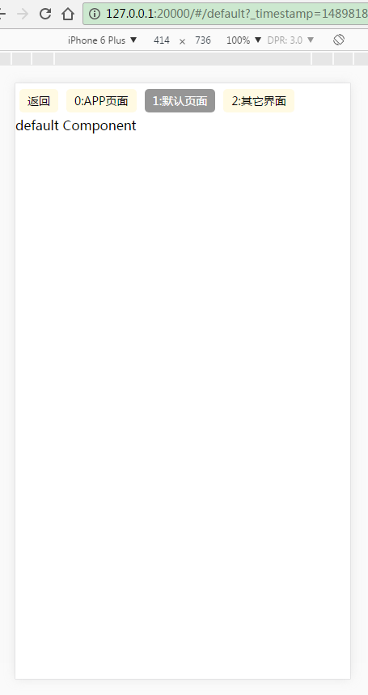

# gulp-react-redux


* [React](https://github.com/facebook/react)
* [React Router](https://github.com/rackt/react-router)
* [Babel](http://babeljs.io) for ES6 and ES7 magic
* [Redux](https://github.com/rackt/redux)'s futuristic [Flux](https://facebook.github.io/react/blog/2014/05/06/flux.html) implementation
* [React Router Redux](https://github.com/reactjs/react-router-redux) Redux/React Router bindings.
* [ESLint](http://eslint.org) to maintain a consistent code style
* [multireducer](https://github.com/erikras/multireducer) to combine single reducers into one key-based reducer
* [style-loader](https://github.com/webpack/style-loader), [sass-loader](https://github.com/jtangelder/sass-loader) and [less-loader](https://github.com/webpack/less-loader) to allow import of stylesheets in plain css, sass and less,
* [bootstrap-sass-loader](https://github.com/shakacode/bootstrap-sass-loader) and [font-awesome-webpack](https://github.com/gowravshekar/font-awesome-webpack) to customize Bootstrap and FontAwesome
* [react-helmet](https://github.com/nfl/react-helmet) to manage title and meta tag information on both server and client


## 安装项目依赖

```bash
npm install
```

## 运行项目

```bash
gulp
```





